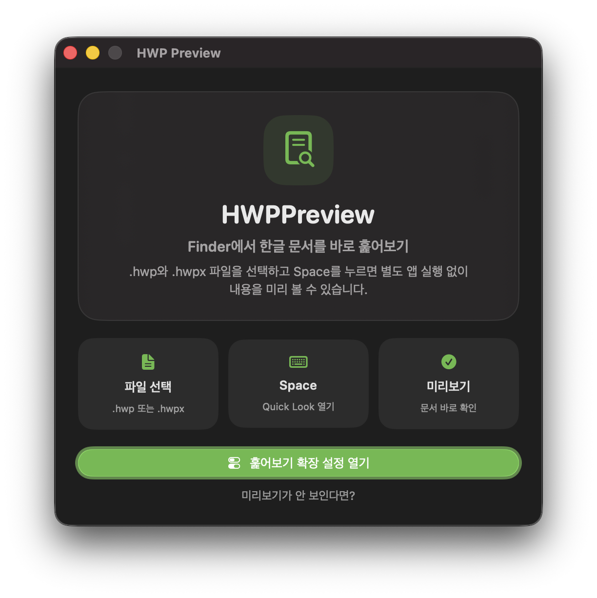

# HWPPreview

[](https://github.com/ny0510/HWPPreview/releases)
[](https://github.com/ny0510/HWPPreview/releases)
[](https://www.apple.com/macos/)
[](LICENSE)

Finder에서 `.hwp`, `.hwpx` 한글 문서를 바로 훑어볼 수 있게 해주는 macOS Quick Look 확장입니다. 별도 문서 뷰어를 열지 않아도 파일을 선택하고 Space만 누르면 미리보기를 확인할 수 있습니다.

## Screenshot



## Features

- Finder Quick Look에서 `.hwp`, `.hwpx` 문서 미리보기
- 트랙패드 핀치 제스처로 문서 확대 및 축소
- 문서 미리보기만 남긴 가벼운 WebView 렌더러
- `rhwp` 기반 HWP/HWPX 파싱 및 SVG 렌더링

## Installation

### Homebrew

아래 명령으로 설치할 수 있습니다.

```sh
brew install --cask ny0510/tap/hwppreview
xattr -dr com.apple.quarantine /Applications/HWPPreview.app
```

### GitHub Releases

1. [Releases](https://github.com/ny0510/HWPPreview/releases)에서 최신 `HWPPreview.zip`을 다운로드합니다.
2. 압축을 풀고 `HWPPreview.app`을 `/Applications` 폴더로 이동합니다.
3. 아래 명령으로 다운로드 격리 속성을 제거합니다.

```sh
xattr -dr com.apple.quarantine /Applications/HWPPreview.app
```

4. 앱을 한 번 실행해 Quick Look 확장을 macOS에 등록합니다.

GitHub Releases와 Homebrew 빌드는 Apple Developer ID로 서명하거나 공증하지 않은 ad-hoc 서명 빌드입니다. 개발자 계정 없이 배포하기 위한 차선책이므로, 설치 후에는 위 격리 속성 제거 과정이 필요할 수 있습니다.

## Usage

1. `HWPPreview.app`을 한 번 실행합니다.
2. 시스템 설정에서 `일반` > `로그인 항목 및 확장 프로그램` > `Quick Look`으로 이동합니다.
3. `HWPPreview` Quick Look 확장을 켭니다.
4. Finder에서 `.hwp` 또는 `.hwpx` 파일을 선택하고 Space를 누릅니다.

## Troubleshooting

Quick Look 확장을 켰는데도 미리보기가 표시되지 않으면 아래 순서대로 확인하세요.

```sh
qlmanage -r
qlmanage -r cache
killall Finder
```

macOS의 보안 정책으로 인해 앱이 "손상되었으므로 열 수 없습니다"라는 오류가 발생하거나 GitHub Releases/Homebrew 빌드의 Quick Look 확장이 보이지 않을 수 있습니다. 이 경우 앱을 `/Applications`로 옮긴 뒤 아래 명령으로 격리 속성을 제거하고, 앱을 한 번 실행한 후 Quick Look 확장을 다시 켜세요.

```sh
xattr -dr com.apple.quarantine /Applications/HWPPreview.app
```

## Contributing

버그 리포트, 기능 제안, 코드 기여 모두 환영합니다! GitHub Issues나 Pull Requests를 통해 참여해주세요.

## License

HWPPreview는 [MIT License](LICENSE)로 배포됩니다.

이 프로젝트는 HWP/HWPX 문서 파싱과 렌더링을 위해 MIT 라이선스의 [`rhwp`](https://github.com/edwardkim/rhwp)를 번들합니다. 자세한 서드파티 고지는 [THIRD_PARTY_NOTICES.md](THIRD_PARTY_NOTICES.md)를 참고하세요.
